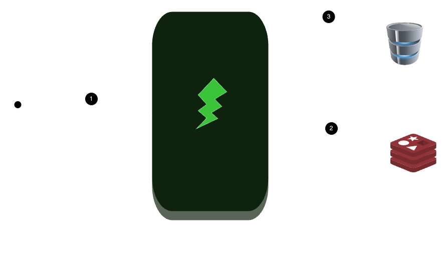

edge case, testing analytics when there is no data
## Application Structure


### Design & Architectural Decisions
1. All redis keys following a similar naming convention `{data_type}:{user_id}:{data_info}`. So for example for the highest number of transactions for user with user_id = 1, we'll have a key of `analytics:{0}:day_of_highest_number_of_transactions`. This convention makes it easy to store data separate for each user and also provides convienient way to retrieve stored data.
2. All data stored in the cache have a limited ttl (Time-To-Live) to reduce the occurence of serving stale data to the end user
3. We don't pass page size (or we have a fixed page size) for the get transactions as it means when dynamic page sizes are passed we would still have to go to the db to fetch data when the data already exists in the db
4. Delete all cached transaction data for user if even one of his transactions is updated / deleted to avoid returning stale data to the customer


## Environment Variable Setup
1. Create a `.env` file at the base of the project and populate it with the values below

```
POSTGRES_DB=fido_assessment
POSTGRES_PASSWORD=password
POSTGRES_PORT=5432
POSTGRES_USER=gideon


DATABASE_NAME=fido_assessment
DATABASE_PASSWORD=password
DATABASE_PORT=5432
DATABASE_SERVER=db
DATABASE_USER=gideon

REDIS_HOST=redis
REDIS_PORT=6379
REDIS_DB=0
REDIS_PROTOCOL=3

APPLICATION_PORT=8000
```
## Docker Setup
- Your system must have both Docker and Docker Compose installed.
The API service together with other required services like the redis cache and db have been setup in `docker-compose.yml`
1. To run the project you'll have to build first. You can do this by running the following command `docker compose build` and the you can start the application by running the following commands `docker compose --env-file .env up -d`
2. Running tests `docker container exec -it assessment-api-1 bash -c "pytest ./test.py -v"`

## Notes
1. The SQL data has user data with ids from 1 - 100
2. The entire setup uses ports 5432, 8000 and 6379 so you may want to kill any processes running on those ports